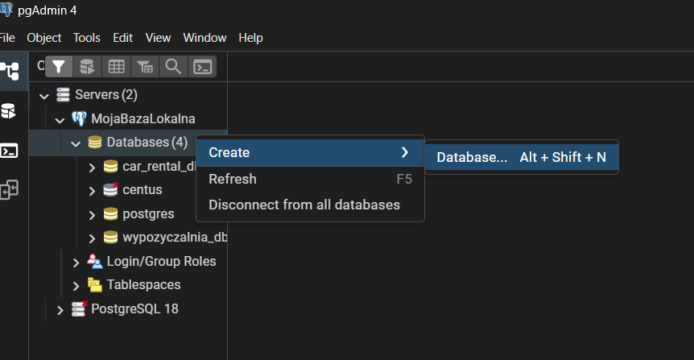
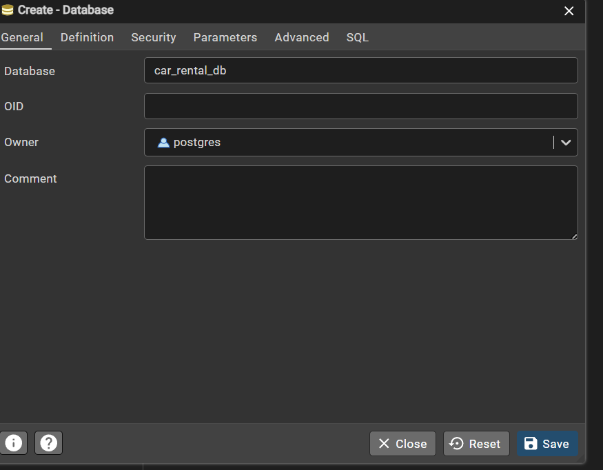
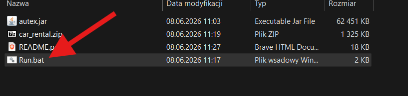
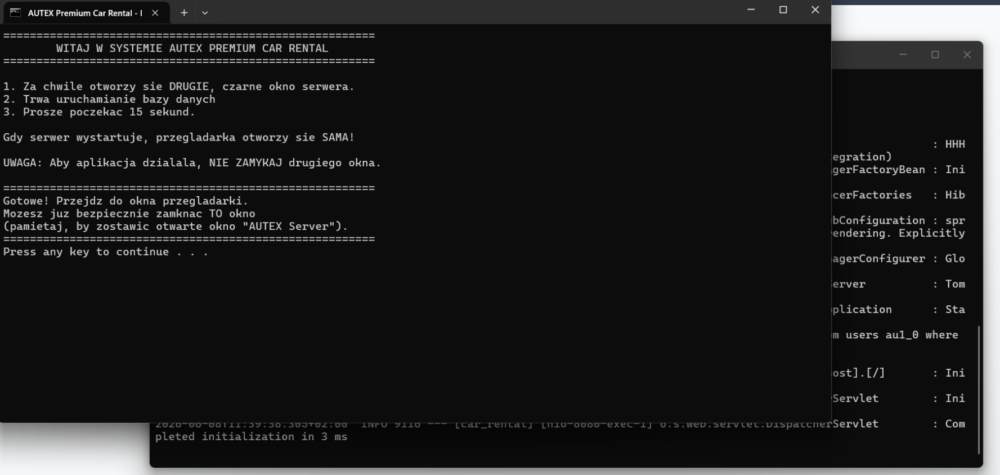
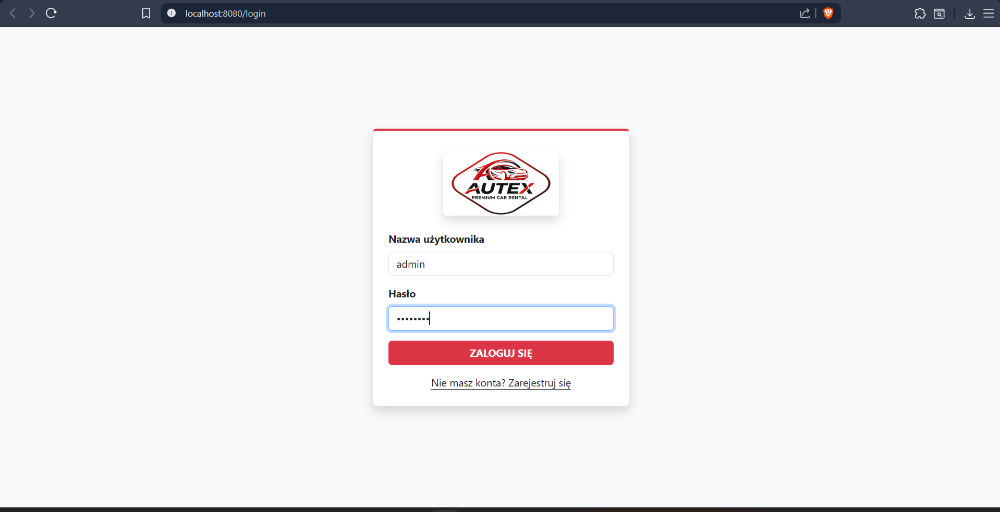

**Instrukcja uruchomienia aplikacji „AUTEX Premium Car Rental”**

**Wymagania wstępne:**

* Zainstalowane środowisko Java (JDK 17 lub nowsze).
* Zainstalowany serwer bazy danych PostgreSQL (oraz narzędzie np. pgAdmin4).

**1. Rozpakowanie plików projektu**

Pobierz dostarczone archiwum z projektem (np. Autex_Projekt_Zbiciak.zip) na dysk twardy, a następnie wypakuj jego zawartość
do wybranego folderu. Wewnątrz wypakowanego folderu powinieneś znaleźć skompilowany plik aplikacji (autex.jar) oraz skrypt uruchomieniowy (run.bat).

**2. Przygotowanie bazy danych w pgAdmin**

Aplikacja wykorzystuje technologię Hibernate, która zwalnia użytkownika z konieczności ręcznego importowania tabel i skryptów SQL. Wymagane jest jedynie utworzenie pustej bazy.

1. Otwórz narzędzie **pgAdmin4** i zaloguj się do swojego serwera PostgreSQL.
2. Kliknij prawym przyciskiem myszy na *Databases* -> *Create* -> *Database...*
3. W polu *Database* wpisz dokładnie nazwę: **car_rental_db** i kliknij *Save* .

* 

*Uwaga: Aplikacja domyślnie łączy się z bazą na porcie 5432, używając loginu postgres i hasła admin. W przypadku innej konfiguracji lokalnej, konieczna jest zmiana tych danych w pliku application.properties przed kompilacją pliku .jar.*

**3. Uruchomienie aplikacji**

Aby uruchomić system, nie musisz instalować dodatkowych serwerów webowych – aplikacja posiada wbudowany serwer Apache Tomcat.

1. Wejdź do wypakowanego folderu z projektem.
2. Kliknij dwukrotnie plik uruchomieniowy  **run.bat** .

* 

Na ekranie pojawią się dwa okna konsoli. Pierwsze z nich wyświetli instrukcje systemu AUTEX i odliczy 15 sekund. Drugie, działające w tle, uruchomi serwer i automatycznie wygeneruje w bazie car_rental_db wszystkie niezbędne tabele oraz relacje.

* 

**4. Dostęp do aplikacji i dane startowe**

Dzięki zastosowaniu skryptu run.bat, po upływie 10 sekund aplikacja **automatycznie otworzy się w Twojej domyślnej przeglądarce internetowej** pod adresem: http://localhost:8080/login

* 

Aby ułatwić testowanie systemu, aplikacja posiada wbudowany moduł DataInitializer. Po pierwszym uruchomieniu na pustej bazie danych, system automatycznie zaopatruje flotę w 5 luksusowych pojazdów oraz tworzy **główne konto administratora** .

Aby przetestować pełną funkcjonalność (w tym Panel Administratora i dodawanie aut), kliknij opcję logowania i użyj poniższych anych:

* **Login**: admin
* **Hasło**: admin123

Po zalogowaniu w górnym pasku nawigacji pojawią się dodatkowe opcje administracyjne pozwalające na zarządzanie flotą oraz weryfikację i usuwanie rezerwacji dokonanych przez użytkowników.
